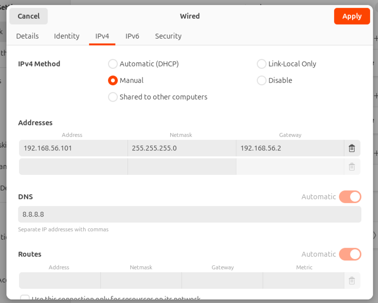

# docker 환경 설정(local)
- virtual box 설치
- virtual box ubuntu 설치 준비
    - 네트워크
        - 어댑터1 : NAT
        - 어댑터2 : 호스트전용 네트워크 (설정에서 별도로 추가해야함)
    - 마운트 디스크
        - 기본 100gb로 설정
        - (선택) 별도의 디스크를 두어서 docker파일만 관리하고 싶으면 디스크를 하나 더 만든다.
    - CPU : 4코어
    - RAM : 4096 (4g)
- ubuntu 설치
    - mac(실리콘 cpu)에서는 desktop 버전이 설치되지 않음
    - ubuntu server 설치후에 `ubutu-desktop` 설치
        - `sudo apt-get update && sudo apt-get install -y ubuntu-desktop-minimal`
- ubuntu 네트워크 설정
    - 2개의 네트워크가 있을텐데.. 거기서 192.168.56.xxx로 설정된 부분을 변경
      
    - 변경후에 ssh 접속
- 프로그램 설치
    - filezila 설치
    - ssh 접속은 iterm이용
- (vm) docker 사용에 필요한 패키지 설치
  ```shell
  ~$ sudo apt-get install -y \
  > apt-transport-https \
  > ca-certificates \
  > curl \
  > gnupg-agent \
  > software-properties-common
  ```
- (vm) docker 에서 제공하는 shell script을 이용한 자동 설치
  ```shell
  ~$ curl -fsSL https://get.docker.com -o get-docker.sh
  # shell script 내용 확인 후 변경 가능
  ~$ sudo vi get-docker.sh
  # 실행 권한 부여
  ~$ chmod +x get-docker.sh
  # 설치
  ~$ sudo sh get-docker.sh
  ```
- (vm) docker 그룹에 현재 사용 중인 계정을 등록하여 sudo 없이 docker 명령을 사용 가능하게 함
  ```shell
  $ sudo usermod -aG docker [계정명]
  $ sudo systemctl daemon-reload
  $ sudo systemctl enable docker
  $ sudo systemctl restart docker
  # 명령어 실행후에 세션종료후 다시 접속하여 docker version 실행해 본다.
  ```