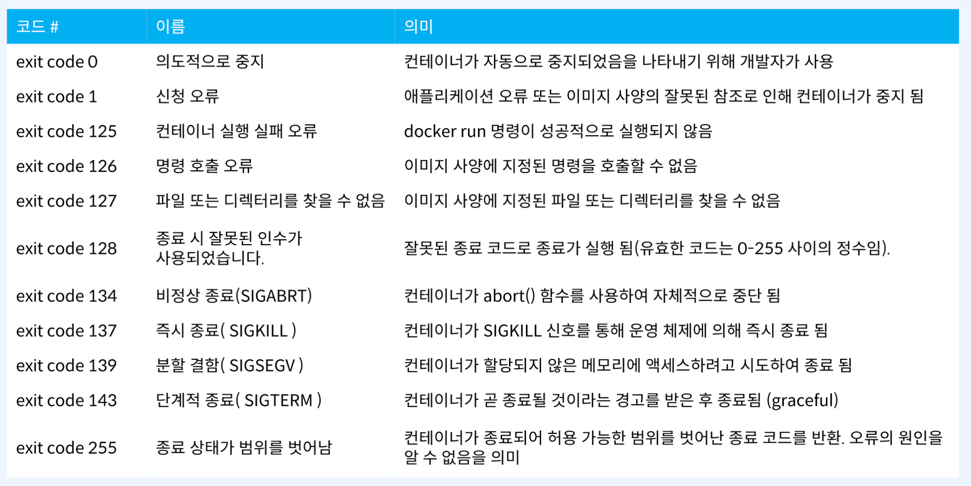

# docker container cli
- `https://docs.docker.com/reference/cli/docker/container/` 경로에서 컨테이너 관련 명령어 확인가능
- cAdvisor : 도커내의 메트릭 정보 확인(웹브라우저로 확인 가능)
- `docker top`: 컨테이너에서 실행 중인 프로세스 조회
- `docker port`: 컨테이너에 매핑된 포트 조회
- `docker logs`: 도커 로그 확인
    - 로그관리 : 로그데이터를 제대로 관리하지 않으면 disk full 현상이 발생해서 서비스가 원활하게 지속될 수 없다.
        - 전체적으로 관리하는 방법
        - 컨테이너 단위로 로그 관리
- `docker events`: 도커에서 발생되는 이벤트를 확인할 수 있음
- `docker kill`
- `docker exit code`
  
- `docker attach | exec`
- `docker diff` : 변동사항 확인
- `docker commit`: 실제적으로 운영중인 컨테이너의 변동사항을 신규 이미지로 저장을 하고 싶을 때 사용
- `docker export | import`
    - docker export - 실행 중인 컨테이너의 파일 시스템을 tar archive로 내보내기 (backup, migration)
    - export는 image save와 다르게 이미지의 layer에 대한 내용은 포함되지 않고, export로 추출한 컨테이너 내의 정보는 하나의 레이어로 통합된다
    - export를 통해 만들어진 이미지는 단순히 컨테이너의 파일시스템을 아카이빙해서 만든 이미지이기 때문에 컨테이너 run 후 실행할 명령 (CMD)이 요구된다.
        - `docker: Error response from daemon: No command specified.`에러 발생
            - import 시 CMD를 추가하는 방법과 Dockerfile에 import된 이미지와 CMD를 추가하여 생성.
            - import된 이미지를 Dockerfile에 CMD를 추가하여 새로 빌드 
  