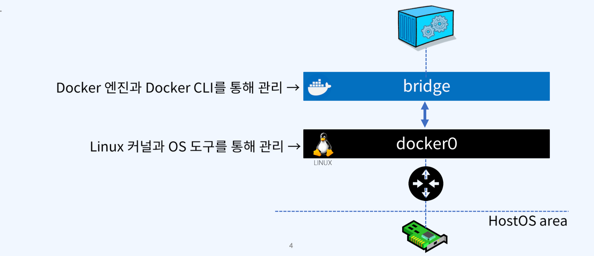
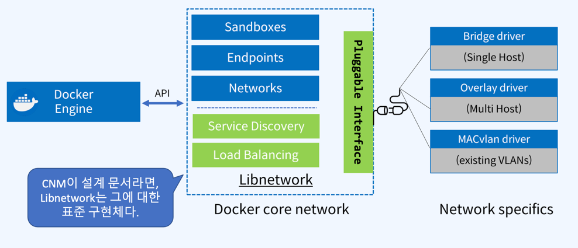
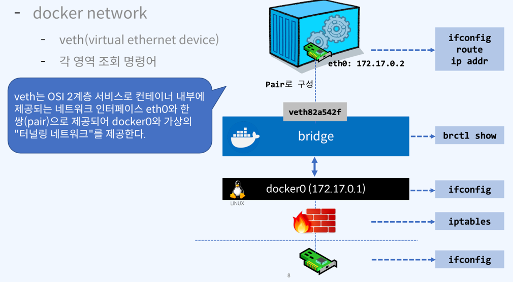
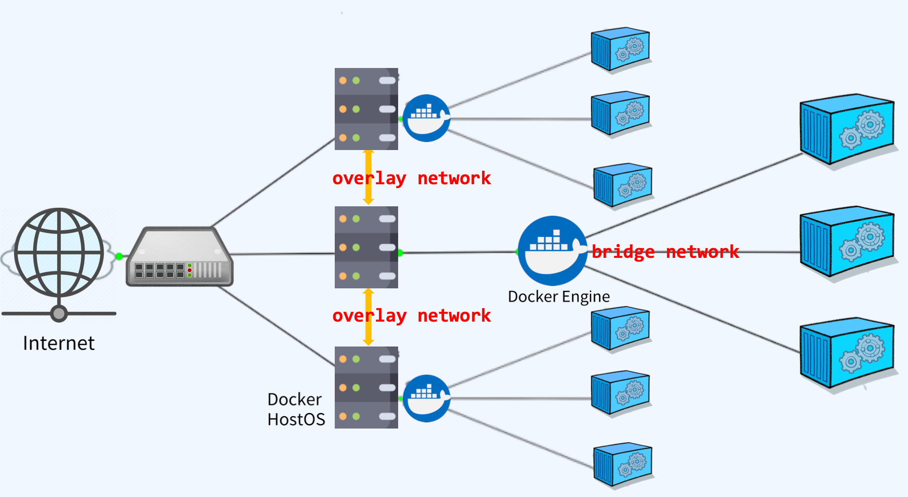
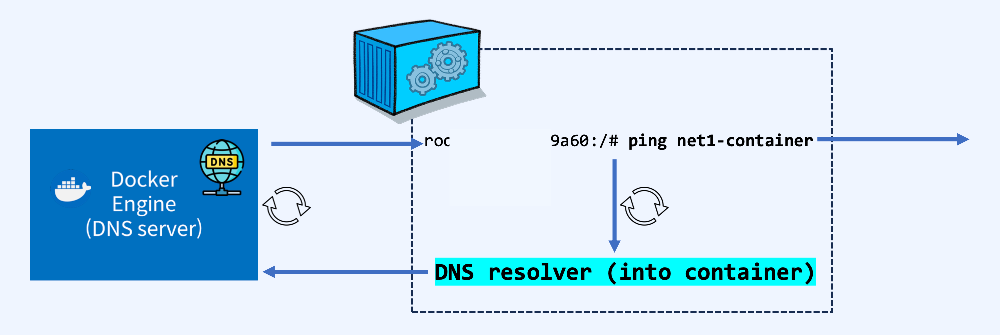

# 도커 네트워크
- 도커 네트워크는 커널의 네트워크 스택의 하위로, 상위에는 네트워크 드라이버를 생성. 즉, docker network = Linux network
### Linux bridge
  - 리눅스 브릿지는 커널 내부의 물리적 스위치를 가상으로 구현한 OSI Layer 2 Device
  - 트래픽을 검사하여 동적으로 학습되는 MAC주소를 기반으로 트랙픽을 전달함.
    
### Network namespace
  - 커널에 격리된 네트워크 스택으로 자체 인터페이스, 라우트 및 방화벽 규칙을 보유
  - 컨테이너와 리눅스의 보안적인 측면으로, 컨테이너를 격리하는데 사용
  - 네트워크 네임스페이스는 도커 네트워크를 통해 구성된 경우가 아니면 동일한 호스트의 두 컨테이너가 사로 통신하거나 호스트 자체와 통신할 수 없음을 보장
  - 일반적으로 CNM(Container Network Model)네트워크 드라이버는 각 컨테이너에 대해 별도의 네임스페이스를 구현
  - CNM(Container Network Model)
  - libnetwork(https://github.com/moby/libnetwork) : CNM의 구현체
    
### veth (virtual ethernet device)
  - 두 네트워크 네임스페이스 사이의 연결선으로 동작하는 리눅스 네트워킹 인터페이스
  - `veth`는 각 네임스페이스에 단일 인터페이스가 있는 전이중(full duplex link) 링크
  - 한 인터페이스의 트래픽을 다른 인터페이스로 전달
  - 도커 네트워크를 만들 때 도커 네트워크 드라이버는 veth를 사용하여 네임스페이스간의 명시적인 연결을 제공
  - 컨테이너가 도커 네트워크에 연결되면 veth의 한쪽 끝은 컨테이너 내부에 배치되며, 다른 쪽은 도커 네트워케 연결된다.
  - 컨테이너는 직접적으로 브릿지와 연결되지 못한다. 중간에 터널링 네트워크를 구현하는 `veth`가 존재
  - 브릿지 네트워크는 `docker 0`와 연결된 하나의 모델 (`brctl show`(리눅스) 명령어로 확인가능)
 
  - iptable에 도커 컨테이너와 연결된 정보를 확인할 수 있다.
    - `sudo iptables -t nat -L -n`
### overlay network
  - overlay network는 서로 다른 호스트에서 서비스되는 컨테이너를 네트워크로 연결하는데 사용되고, 이런 네트워크 생성을 위해 overlay network driver를 사용한다.
  - 네트워크로 연결된 여러 docker host안에 있는 안에 있는 Docker Daemon간의 통신을 관리하는 가상 네트워크
  - 컨테이너는 overlay network의 서브넷에 해당하는 IP 대역을 할당받고 받은 IP를 통해 상호간의 내부통신을 수행한다.
  - overlay network에 포함되어 있는 모든 컨테이너들은 서로 다른 DockerHost에 있는 컨테이너와 같은 서버에 있는 것처럼 통신이 가능해진다.
  - `Docker swarm`을 통해 구현
  
### `--net` 옵션
- 도커는 기본적으로 host os와 bridge 연결을 한다. 그러나 --net 옵션을 통해서 네트워크 설정이 가능하다.
- `--net=brdige`: default
- `--net=none`: 네트워크를 사용하지 않음.
- `--net=container:[container name | id]`: 다른 컨테이너의 네트워크를 사용
- `--net=host`: 컨테이너가 호스트OS의 네트워크를 사용
- `--net=[사용자정의 네트워크 name]`: 사용자 정의 네트워크 사용

### docker DNS
- Docker 컨테이너는 IP를 사용자 정의 네트워크의 컨테이너 이름으로 자동확인하는 DNS서버가 Docker호스트에 생성된다.
- 동일 네트워크 alias할당을 통해 하나의 타켓그룹을 만들어 요청에 `RoundRobin`방식으로 응답한다.
- 컨테이너 생성 시 호스트 시스템에서 다음의 3개의 파일을 복사하여 컨테이너 내부에 작어용하여 컨테이너간의 이름으로 찾기가 가능해진다.
  - /etc/hostname
  - /etc/hosts
  - /etc/resolv.conf
- 컨테이너 내부에서 동일 네트워크의 다른 컨테이너명으로 ping을 수행하는 과정
  
- 도커DNS을 활용하면 docker proxy(Load Balancing)이 가능하다.

